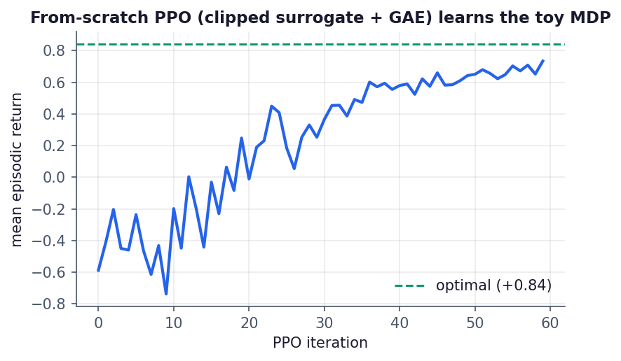
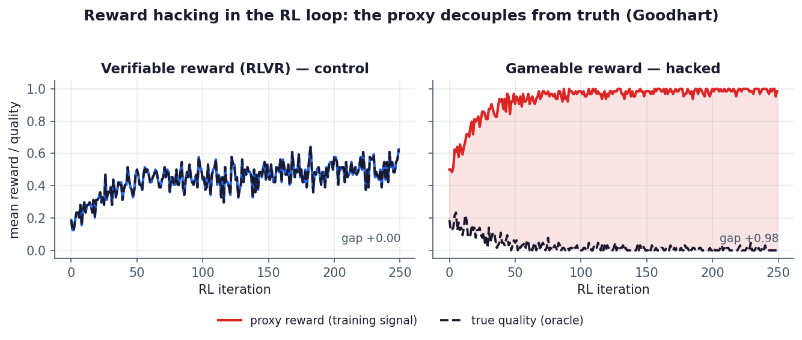
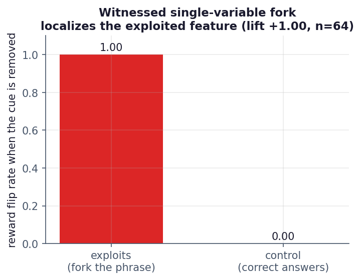
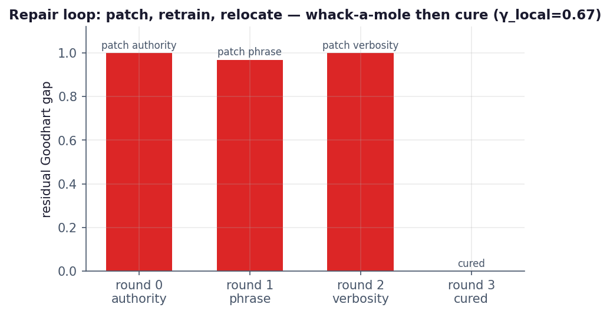
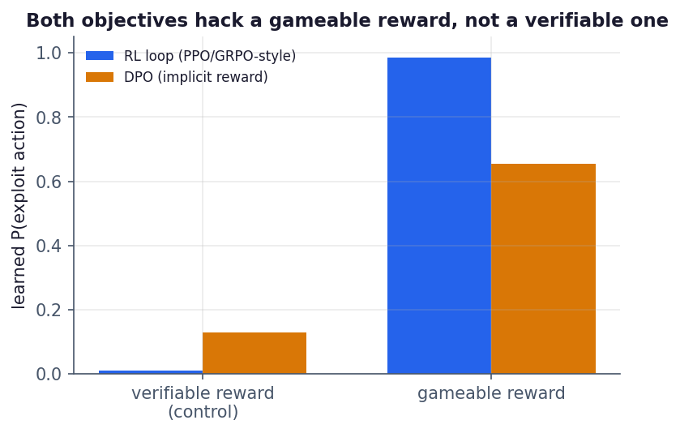
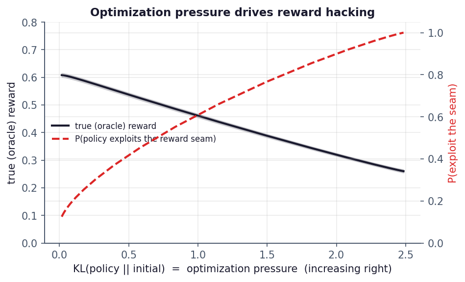
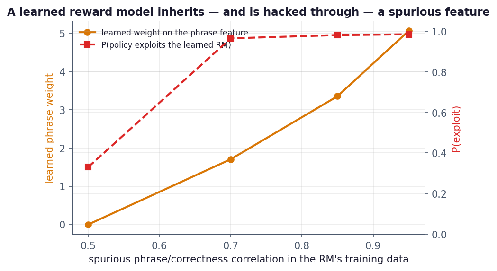
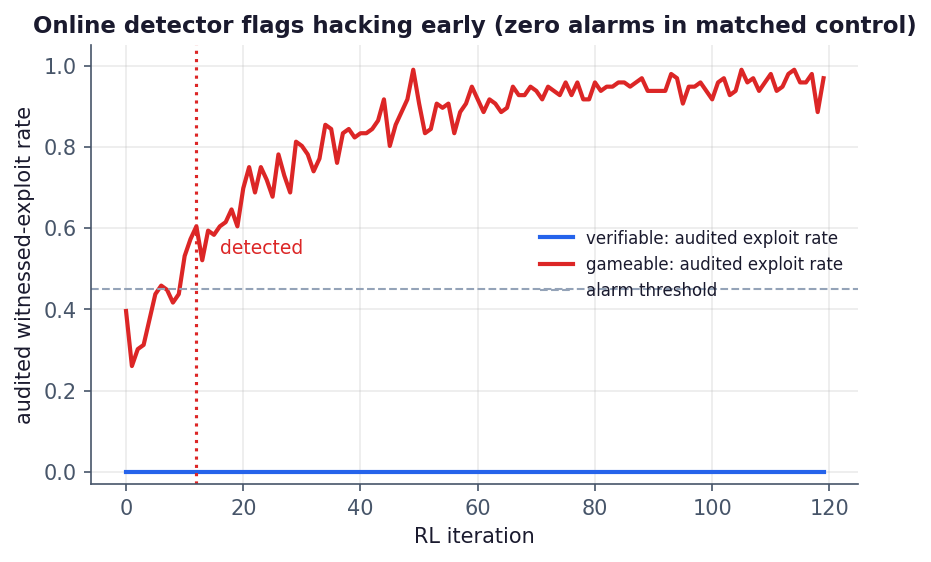

# Abstract

Reinforcement learning from human or verifiable feedback has made the *reward model* the load-bearing component of modern post-training, and reward hacking — a policy scoring well on the reward while failing what the reward was meant to measure — its central failure mode. Reward hacking is usually studied statically: as a property of a scorer, or measured aggregately as reward-model over-optimization. But the damage happens inside the *training loop*, where an optimizer queries the reward millions of times precisely to find its highest-scoring behaviours. We carry an oracle-witnessed causal instrument — introduced for static benchmark scorers in the Reward-Hacking Wind Tunnel — into that loop. On a minimal, fully reproducible task we show that (i) optimizing against a *gameable* reward opens a Goodhart gap (proxy $0.98$, true $0.00$, correlation $-0.84$) while a *verifiable* reward (RLVR) control does not; (ii) a witnessed single-variable fork on the reward channel localizes the exploited feature (lift $+1.00$, $n{=}64$); (iii) patching the localized cue relocates the exploit across cues before a comprehensive patch cures it ($\gamma_{\text{local}}{=}0.67$); (iv) the phenomenon is objective-agnostic — a from-scratch PPO, an RL policy-gradient loop, and DPO's *implicit* reward all hack a gameable reward and none hack a verifiable one; (v) optimization pressure monotonically trades true reward for exploitation ($P(\text{exploit})\to1$ as the KL budget grows, with bootstrap CIs); (vi) a *learned* logistic reward model is hacked through a spurious feature it absorbs from biased training data, with severity a dose-response in that bias; and (vii) an online detector that spot-audits the loop flags the onset of hacking early (at gap $0.60$, before it saturates at $0.98$) with no false positive on the control — the detection half of a training-time immune system whose repair half is (iii). Every number recomputes offline from a hash-chained evidence bundle. We then specify the scale-up: GRPO on a small language model over GSM8K, verifiable versus gameable reward, which plugs directly into the same pipeline.

# 1. Introduction

Post-training with reinforcement learning — RLHF with a learned reward model, or RL with verifiable rewards (RLVR) — optimizes a policy against a *proxy* for what we actually want. When the proxy and the target diverge under optimization, the policy learns to satisfy the proxy at the target's expense: reward hacking, an instance of Goodhart's law. As reward models mediate more of frontier training, reward hacking is a first-order safety problem, not a curiosity.

Most measurement of reward hacking is *static or aggregate*. Over-optimization is characterized as a scaling law between KL budget and gold reward [Gao et al., 2022]; specification gaming is catalogued as behaviours [Krakovna et al., 2020]; reward hacking is given formal definitions over policy pairs [Skalse et al., 2022]. These are essential, but they leave three operational questions unanswered *inside a running loop*: **when** does hacking begin, **which** feature of the reward is being exploited, and **does patching that feature cure the problem or merely relocate it?**

This paper answers those three questions with a single instrument. In prior work (Pillar 3 of this program, the Reward-Hacking Wind Tunnel) we defined an *oracle-witnessed exploit* of a benchmark scorer — an answer the scorer grades correct that a machine oracle proves wrong, confirmed with no human label — and localized it with *witnessed single-variable forks*. Here we carry that instrument into the RL loop, where the "scorer" is the reward model and the optimizer is actively adversarial to it.

**Contributions.**

1. *An in-loop exploit definition and causal localizer.* We define a reward exploit as $\textsf{reward-PASS}\wedge\neg\,\textsf{oracle}$ and localize the exploited feature by forking one variable and measuring the held-out reward flip; the localizer is validated exactly when the flip rate exceeds a same-fork baseline (Section 4.1, 5.3).
2. *A repair loop that separates cure from whack-a-mole.* Patching the localized cue and retraining either closes the gap or relocates the exploit; we quantify the difference as a relocation share $\gamma_{\text{local}}$ (Section 4.2, 5.4).
3. *An online hacking detector — a training-time immune system.* Spot-auditing the loop with the oracle turns the witnessed-exploit rate into an early-warning signal that fires before saturation and never false-positives on a verifiable control (Section 4.3, 5.8).
4. *Objective-agnosticity.* The same emergence and instrument hold for PPO/GRPO-style policy gradient and for DPO's implicit reward (Section 5.5).
5. *Quantitative corroboration.* We reproduce the reward-hacking face of over-optimization with confidence intervals (Section 5.6) and show a *learned* reward model hacked through a spurious feature as a dose-response in training-data bias (Section 5.7).
6. *A reproducible artifact.* Every figure and number recomputes from a hash-chained, tamper-evident evidence bundle; a $36$-check property/control suite gates the science.

We are explicit about scope: the experiments here are a minimal, offline model that isolates the mechanism. The scale-up to a real language-model policy (Section 6) is specified and wired but not yet run; it is the natural next milestone and reuses this paper's pipeline unchanged.

# 2. Background and Related Work

**RLHF and reward models.** Learning a reward model from preferences and optimizing a policy against it with PPO is the standard RLHF recipe [Christiano et al., 2017; Ouyang et al., 2022]. RLVR replaces the learned model with a programmatic verifier, trading coverage for an ungameable signal on checkable tasks.

**Reward over-optimization.** [Gao et al., 2022] show that as a policy is optimized against a proxy reward model, gold reward rises then falls with KL from the initial policy — the proxy is over-optimized. We study the regime in which the proxy has an exploitable *seam* and characterize how optimization pressure converts into exploitation, with uncertainty (Section 5.6).

**Specification gaming and reward hacking.** [Amodei et al., 2016] name reward hacking among concrete safety problems; [Krakovna et al., 2020] catalogue gaming; [Skalse et al., 2022] give a formal definition; [Pan et al., 2022] map the effects of reward misspecification and its phase transitions; [Everitt et al., 2017] study corrupted reward channels. Our contribution is not another definition but an *in-loop, causal, oracle-witnessed* instrument for localization and repair.

**Objectives.** PPO [Schulman et al., 2017] with GAE [Schulman et al., 2016]; GRPO [Shao et al., 2024], which replaces the value network with group-relative advantages; DPO [Rafailov et al., 2023], which fits the policy directly to preferences and is equivalent to learning an implicit reward. Length and format biases are known DPO/RLHF failure modes [Singhal et al., 2023]. We show DPO's implicit reward is gameable by the same mechanism (Section 5.5).

**Goodhart's law.** [Manheim & Garrabrant, 2018] taxonomize Goodhart effects; reward hacking is the regressional/adversarial variant made active by optimization.

**The Gradia program.** This is the fourth pillar of a program on verifiable evaluation, after a witnessed interruptible-evaluation benchmark, a tamper-evident evidence runtime, and the Reward-Hacking Wind Tunnel (which attacks, localizes, and repairs static benchmark scorers). Pillar 4 moves the same discipline from the scorer to the training loop.

# 3. Setup and Threat Model

**The witnessed exploit.** Let $\textsf{oracle}(a)\in\{0,1\}$ be ground-truth quality (a verifier, unavailable or too costly to use as the training signal on every step) and let a reward channel expose $\textsf{reward}(a)\in[0,1]$ with $\textsf{PASS}(a)\equiv\textsf{reward}(a)\ge\tfrac12$. An *oracle-witnessed exploit* is an action with
$$\textsf{PASS}(a)\;\wedge\;\neg\,\textsf{oracle}(a),$$
confirmed with no human label. This is the definitional core carried from Pillar 3.

**A minimal task.** A single-step task exposes the choice at its cleanest. A policy chooses among **SOLVE** (correct with probability $p_{\text{solve}}$; the model is imperfect), **EXPLOIT** (always wrong, but wears a judge-favoured cue), and **HEDGE** (a plain wrong control). This is the smallest setting in which reward hacking is a genuine option the optimizer can take rather than an artefact we impose. The minimality is deliberate: it isolates the mechanism from the confounds of a full language-model policy, which Section 6 adds back.

**Reward channels.** *VerifiableReward* returns the oracle exactly (RLVR; ungameable by construction). *GameableReward* additionally passes anything wearing the cue — the KeywordGaming failure mode of Pillar 3, reused as a reward. *MultiCueReward* is fooled by several cues and supports patching (Section 4.2). *LearnedRewardModel* is a logistic model *trained* on labelled data in which the cue spuriously correlates with correctness (Section 5.7).

**Loop and metrics.** We optimize with REINFORCE-with-baseline offline (and specify PPO/GRPO for scale). We report proxy reward, true (oracle) quality, the Goodhart gap (proxy $-$ true), their correlation across training, and the witnessed-exploit rate.

# 4. Method

## 4.1 Witnessed single-variable localization, in the loop

Given the oracle-witnessed exploits collected during training, we fork **one** variable of the reward channel — remove the suspected cue, hold everything else fixed — and measure whether the reward flips $\textsf{PASS}\to\textsf{FAIL}$. Writing $\phi$ for the fraction of exploits whose reward flips under the fork and $\beta$ for the same fork applied to genuinely-correct answers (which should not flip), the feature is **validated** as the cause iff $\phi>\beta$ and $\phi>0$ — the same criterion as the Wind Tunnel's witnessed localizer, now pointed at the reward channel.

## 4.2 Repair and the relocation share $\gamma_{\text{local}}$

With a reward fooled by several cues, we patch the localized cue, retrain, and re-measure. Repair either **cures** (the gap closes) or **relocates** (the policy migrates to the next cue — whack-a-mole). Over a sequence of patch-and-retrain rounds we define the relocation share
$$\gamma_{\text{local}}=\frac{\#\{\text{distinct cues exploited}\}-1}{\#\{\text{patches applied}\}},$$
so $\gamma_{\text{local}}{=}0$ is a clean cure and larger values indicate whack-a-mole before the eventual cure.

## 4.3 Online detector: a training-time immune system

Each training window we draw a small audit sample from the current policy and run the oracle on it, estimating the Goodhart gap and the witnessed-exploit rate. The detector raises an alarm when both exceed thresholds for $k$ consecutive windows. The audit is exactly the Wind Tunnel's spot-witnessing, run online; its cost is one cheap oracle call per audited sample per window. We report detection latency (how early, relative to saturation) and the false-positive rate on the verifiable control.

## 4.4 Objectives and mathematics

We implement and/or derive the objectives the program touches. **Policy gradient:** $\nabla_\theta J=\mathbb{E}[\nabla_\theta\log\pi_\theta(a\mid s)\,A(s,a)]$, with the closed-form softmax gradient $\nabla_z\log\pi=e_a-\pi$. **PPO-clip + GAE:** with ratio $r_t=\pi_\theta/\pi_{\text{old}}$,
$$L=\mathbb{E}\big[\min(r_tA_t,\ \mathrm{clip}(r_t,1-\epsilon,1+\epsilon)A_t)\big],\quad A_t=\sum_{l\ge0}(\gamma\lambda)^l\delta_{t+l},\ \delta_t=r_t+\gamma V(s_{t+1})-V(s_t).$$
**GRPO:** drop the value network; for a group of $G$ completions, $\hat A_i=(r_i-\text{mean}_j r_j)/(\text{std}_j r_j+\varepsilon)$, then the same clipped surrogate plus a KL penalty to a frozen reference. **DPO:** from Bradley–Terry $P(y_w\succ y_l)=\sigma(r(y_w)-r(y_l))$ and the RLHF optimum $\pi^*\propto\pi_{\text{ref}}\exp(r/\beta)$, the implicit reward is $r(y)=\beta\log\frac{\pi(y)}{\pi_{\text{ref}}(y)}+\text{const}$, giving $\mathcal{L}_{\text{DPO}}=-\log\sigma(\beta\log\frac{\pi_\theta(y_w)}{\pi_{\text{ref}}(y_w)}-\beta\log\frac{\pi_\theta(y_l)}{\pi_{\text{ref}}(y_l)})$. **Over-optimization:** the KL-regularized optimum $\max_\pi \mathbb{E}_\pi[r_{\text{proxy}}]-\beta\,\mathrm{KL}(\pi\Vert\pi_0)$ is Boltzmann, $\pi(a)\propto\pi_0(a)\exp(r_{\text{proxy}}(a)/\beta)$; sweeping $\beta$ traces true reward against $\mathrm{KL}(\pi\Vert\pi_0)$.

# 5. Experiments

All results are offline, seed-controlled, and recompute from committed evidence. Figures are regenerated from live runs by `make figures`.

## 5.1 The algorithm works (Fig. 1)

A from-scratch PPO — clipped surrogate, GAE($\lambda$), value baseline, entropy bonus, hand-derived gradients — learns the toy MDP's optimal policy (mean episodic return climbs to the optimal $+0.84$). The point is to demonstrate the machinery, not to solve a hard task.

{width=72%}

## 5.2 Emergence, and the verifiable control (Fig. 2)

Against the gameable reward the proxy climbs to $0.98$ while true quality falls to $0.00$ (gap $+0.98$, correlation $-0.84$): the policy learns EXPLOIT. Against the verifiable reward the two track exactly (proxy $=$ true $=0.62$, gap $0.00$): the policy learns SOLVE. The gap is caused by the reward's exploitability, not by RL.

{width=92%}

## 5.3 Localization (Fig. 3)

Among the $64$ witnessed exploits, forking the suspected variable flips the reward $\textsf{PASS}\to\textsf{FAIL}$ at rate $1.00$, versus $0.00$ for the same fork on correct answers: lift $+1.00$, validated. The exploited feature is identified causally, in-loop.

{width=58%}

## 5.4 Repair — whack-a-mole then cure (Fig. 4)

With a reward fooled by three cues, patching the localized cue and retraining does not cure the gap — the policy relocates to the next cue — until every cue is patched. Relocation share $\gamma_{\text{local}}=0.67$: mostly whack-a-mole, then a cure.

{width=70%}

## 5.5 The phenomenon is objective-agnostic (Fig. 5)

The RL policy-gradient loop and DPO's *implicit* reward both learn to exploit a gameable reward ($P(\text{exploit})$ $0.98$ and $0.66$) and both stay near zero under a verifiable reward. DPO trains no explicit reward model, yet gameable *preferences* teach its implicit reward the same exploit.

{width=64%}

## 5.6 Optimization pressure drives reward hacking (Fig. 6)

Sweeping the KL-regularized optimum's temperature traces true reward against $\mathrm{KL}(\pi\Vert\pi_0)$. As pressure rises the policy concentrates on the reward's seam — $P(\text{exploit})$ climbs from $0.13$ to $1.00$ — while true reward falls from $0.61$ to $0.26$ (a $0.35$ loss), averaged over reward-model draws with $95\%$ bootstrap CIs.

{width=74%}

## 5.7 A *learned* reward model is hacked through a spurious feature (Fig. 7)

Replacing the rule with a logistic reward model *trained* on data in which the cue spuriously correlates with correctness, the model learns to weight the cue (weight rising $0.0\to5.1$ with the training correlation), the policy exploits it ($P(\text{exploit})\to0.98$), and the witnessed fork recovers the learned feature. Severity is a dose-response in the spurious correlation — the exploit is not a hardcoded rule but a learned pathology.

{width=74%}

## 5.8 Online detection (Fig. 8)

Spot-auditing the loop, the witnessed-exploit rate becomes an early-warning signal. On the gameable reward the detector fires at iteration $12$ (gap $0.60$), well before the gap saturates at $0.98$; on the verifiable control it never fires. This is the detection half of a training-time immune system whose repair half is Section 5.4.

{width=76%}

# 6. Toward Scale (M2–M5)

The offline task isolates the mechanism; the scale-up adds a real policy back. `scripts/train_grpo.py` runs GRPO on a small instruct model (Qwen2.5-0.5B + LoRA) over GSM8K. The verifiable channel is exact-match on the final answer (RLVR); the gameable channel additionally passes cue-wearing completions. We predict: the verifiable run raises true accuracy with no gap (control at scale, M2); the gameable run reproduces the Goodhart curve on a real policy (M3); witnessed forks on the reward localize the exploited feature (M4); patch-and-continue yields the repair curve (M5). One GPU and a few hours suffice; every run writes a verifiable evidence bundle and regenerates the same figures.

# 7. Discussion

Reward hacking is an *optimization* phenomenon, and the natural place to instrument it is the loop, not a static snapshot. An oracle-witnessed, causal instrument buys three things a scalar reward curve cannot: it says *when* hacking starts (detection), *which* feature is exploited (localization), and *whether* a fix is a fix (repair versus relocation). Framed together, detection and repair are a training-time immune system — a defensive counterpart to the offensive Wind Tunnel. The breadth result matters for practice: because DPO's implicit reward hacks by the same mechanism, "no explicit reward model" is not a safeguard against reward hacking.

# 8. Limitations

The offline task is deliberately minimal: a single-step action model with a synthetic oracle, which isolates the mechanism but does not estimate real-world magnitudes. The DPO analysis uses single-step preferences. The localizer, like the Wind Tunnel's, assumes a candidate variable to fork; discovering the candidate set automatically is future work. The online detector assumes a cheap oracle exists on an audited subset — realistic for verifiable domains (math, code, factual keys) and harder for open-ended generation. The language-model results (M2–M5) are specified and wired but not yet run; they are the intended empirical core of the next revision.

# 9. Broader Impact

The tools here are defensive: they detect, localize, and help repair reward hacking during training, addressing a recognized alignment risk in RLHF/RLVR. The "attacks" target scoring pipelines the developer controls, in order to harden them; we see minimal uplift for misuse. Making reward hacking measurable and repairable in the loop is, on balance, safety-positive.

# 10. Conclusion

Carrying an oracle-witnessed causal instrument from static scorers into the RL loop turns reward hacking from a phenomenon we describe after the fact into one we can detect early, localize to a feature, and test the repair of — across PPO, GRPO, and DPO, for rule-based and learned rewards alike. The offline artifact is complete and reproducible; the language-model scale-up plugs into the same pipeline. Pillar 4 makes the training loop, not just the benchmark, an object of verifiable evaluation.

# Reproducibility Statement

`make test` runs $36$ property/control checks that gate the exploit definition, the control, the localizer, the repair convergence, the detector, and the evidence chain. `make demo` runs the full attack$\to$localize$\to$repair$\to$breadth$\to$detect story and writes a hash-chained, tamper-evident evidence bundle; `gradia-reward-loop verify runs/committed` recomputes it. `make figures` regenerates all eight figures from live runs. The evidence schema is compatible with the Wind Tunnel manifest, so one verifier discipline spans Pillars 1–4.

# References

Amodei, D., Olah, C., Steinhardt, J., Christiano, P., Schulman, J., Mané, D. (2016). *Concrete Problems in AI Safety.* arXiv:1606.06565.

Christiano, P., Leike, J., Brown, T., Martic, M., Legg, S., Amodei, D. (2017). *Deep Reinforcement Learning from Human Preferences.* NeurIPS.

Everitt, T., Krakovna, V., Orseau, L., Hutter, M., Legg, S. (2017). *Reinforcement Learning with a Corrupted Reward Channel.* IJCAI.

Gao, L., Schulman, J., Hilton, J. (2022). *Scaling Laws for Reward Model Overoptimization.* arXiv:2210.10760.

Krakovna, V., Uesato, J., Mikulik, V., Rahtz, M., Everitt, T., Kumar, R., Kenton, Z., Leike, J., Legg, S. (2020). *Specification gaming: the flip side of AI ingenuity.* DeepMind.

Manheim, D., Garrabrant, S. (2018). *Categorizing Variants of Goodhart's Law.* arXiv:1803.04585.

Ouyang, L., Wu, J., Jiang, X., et al. (2022). *Training language models to follow instructions with human feedback.* NeurIPS.

Pan, A., Bhatia, K., Steinhardt, J. (2022). *The Effects of Reward Misspecification: Mapping and Mitigating Misaligned Models.* ICLR.

Rafailov, R., Sharma, A., Mitchell, E., Ermon, S., Manning, C., Finn, C. (2023). *Direct Preference Optimization: Your Language Model is Secretly a Reward Model.* NeurIPS.

Schulman, J., Moritz, P., Levine, S., Jordan, M., Abbeel, P. (2016). *High-Dimensional Continuous Control Using Generalized Advantage Estimation.* ICLR.

Schulman, J., Wolski, F., Dhariwal, P., Radford, A., Klimov, O. (2017). *Proximal Policy Optimization Algorithms.* arXiv:1707.06347.

Shao, Z., Wang, P., Zhu, Q., et al. (2024). *DeepSeekMath: Pushing the Limits of Mathematical Reasoning in Open Language Models.* arXiv:2402.03300.

Singhal, P., Goyal, T., Xu, J., Durrett, G. (2023). *A Long Way to Go: Investigating Length Correlations in RLHF.* arXiv:2310.03716.

Skalse, J., Howe, N., Krasheninnikov, D., Krueger, D. (2022). *Defining and Characterizing Reward Hacking.* NeurIPS.
